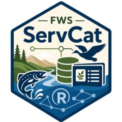

# servcat <a href="https://USFWS.github.io/servcat/"></a>

`servcat` provides an R interface to ServCat, the authoritative
repository for U.S. Fish and Wildlife Service (FWS) data and reference
information.

Use this package to search ServCat, retrieve reference metadata, inspect
related units and subject categories, access saved collections, retrieve
lookup values, and download files associated with ServCat references.

## Installation

You can install the development version of `servcat` from
[GitHub](https://github.com/USFWS) with:

``` r
# install.packages("pak")
pak::pak("USFWS/servcat")
```

Then load the package:

``` r
library(servcat)
```

## Usage

### Get references by ID

ServCat references have unique reference IDs. If you already know one or
more reference IDs, use `get_references()` to retrieve detailed
reference profile records.

``` r
ref <- get_references(140411)

ref
```

You can also pass multiple IDs. Duplicate IDs are removed before
requests are made, and large ID vectors are automatically split into
API-friendly chunks.

``` r
refs <- get_references(c(140411, 140412, 140413))

refs
```

If you only need summary fields, use `get_reference_summaries()`.

``` r
summary_refs <- get_reference_summaries(c(140411, 140412))

summary_refs
```

`get_references()` returns a named list because detailed ServCat profile
records can contain nested metadata. `get_reference_summaries()` returns
a tibble.

### Search for references

Use `search_references()` to run a ServCat Advanced Search with one or
more search criteria. Search criteria are sent in the body of a POST
request, while paging and sorting options are sent as query parameters.

``` r
results <- search_references(
  criteria = list(
    quickSearch = "Kodiak, goats"
  ),
  top = 25,
  page = 1
)

results
```

Page metadata from the ServCat response is stored in the `"page_detail"`
attribute.

``` r
attr(results, "page_detail")
```

You can combine multiple criteria in the request body. `NULL` values in
`criteria` are omitted before the request body is serialized, which is
useful for optional fields such as `logicOperator`, `fieldName`, or
`searchText`.

``` r
reports <- search_references(
  criteria = list(
    visibility = "public",
    textFields = list(
      list(
        order = 1,
        logicOperator = NULL,
        fieldName = "Title",
        searchText = "mountain goat"
      )
    ),
    digitalResources = list(
      list(
        order = 2,
        logicOperator = "AND",
        type = "DigitalFile",
        fieldName = NULL,
        searchText = NULL
      )
    )
  ),
  top = 100,
  page = 1,
  orderby = "dateOfIssue",
  sort = "DESC"
)

reports
```

Common criteria include quick search terms, visibility, legacy status,
version filters, regions, units, text fields, dates, reference types,
reference groups, bounding boxes, subject categories, digital resources,
physical copies, saved collections, and people.

### Retrieve all search-result pages

`search_references()` returns one page by default. Set
`all_pages = TRUE` to retrieve pages sequentially and combine them into
one tibble.

``` r
all_results <- search_references(
  criteria = list(
    quickSearch = "Kodiak, goats"
  ),
  top = 100,
  all_pages = TRUE
)

all_results
```

When `all_pages = TRUE`, the `"page_detail"` attribute contains metadata
for all pages retrieved.

``` r
attr(all_results, "page_detail")
```

### Return composite search results

Some ServCat endpoints return additional composite detail for each
reference. Set `composite = TRUE` when you need richer results than the
standard advanced search response.

``` r
composite_results <- search_references(
  criteria = list(
    quickSearch = "Kodiak, goats"
  ),
  top = 25,
  page = 1,
  composite = TRUE
)

composite_results
```

Composite results may include list-columns with nested information such
as linked resources and associated units.

### Retrieve references from a saved collection

ServCat saved collections group related references. Use
`get_collection_references()` with a saved collection ID to retrieve the
references in that collection.

``` r
collection_refs <- get_collection_references(1397)

collection_refs
```

This is useful when working with curated groups of references, such as
project collections, regional datasets, or topic-based ServCat
collections.

### Retrieve metadata for a reference

After identifying a reference ID, use the metadata helpers to retrieve
additional information about the reference.

``` r
reference_id <- 140411

owners <- get_owners(reference_id)
keywords <- get_keywords(reference_id)
links <- get_links(reference_id)
files <- get_files(reference_id)
bibliography <- get_bibliography(reference_id)
lifecycle <- get_lifecycle(reference_id)
units <- get_units(reference_id)
bboxes <- get_bboxes(reference_id)
subjects <- get_subjects(reference_id)
taxa <- get_taxa(reference_id)
```

These functions return R objects that can be used directly in analysis,
reporting, or downstream data workflows. Most metadata helpers return
tibbles. Some metadata endpoints return named lists because the ServCat
API response is nested or irregular.

### Get file metadata

Use `get_files()` to inspect the digital files attached to a reference
before downloading them.

``` r
files <- get_files(140411)

files
```

To retrieve metadata for one specific file, pass a ServCat resource ID
as `file_id`.

``` r
one_file <- get_files(
  reference_id = 140411,
  file_id = files$resourceId[[1]]
)

one_file
```

When available, `get_files()` preserves the API’s `fileSize` field and
adds `fileSize_kb` for convenience.

### Download files from a reference

Many ServCat references include one or more associated files. Use
`download_files()` to download files attached to a reference.

``` r
downloaded_files <- download_files(
  reference_id = 140411,
  path = "data-raw/servcat-files"
)

downloaded_files
```

`download_files()` returns one row per requested file, including the
local path, ServCat resource ID, download link, `success`, and `error`.
Failed downloads are reported in the returned tibble instead of stopping
the whole batch.

``` r
downloaded_files[, c("resourceId", "localPath", "success", "error")]
```

To download only selected files, pass one or more ServCat resource IDs
with `resource_ids`.

``` r
files <- get_files(140411)

downloaded_file <- download_files(
  reference_id = 140411,
  resource_ids = files$resourceId[1],
  path = "data-raw/servcat-files"
)

downloaded_file
```

You can also use this function in a loop or with
`lapply()`/`purrr::map()` to download files from multiple references.

``` r
reference_ids <- c(140411, 140412, 140413)

downloads <- lapply(
  reference_ids,
  download_files,
  path = "data-raw/servcat-files"
)

downloads
```

### Use lookup lists

The lookup-list helpers return ServCat fixed lists and service metadata.
These are useful when building search criteria, validating inputs, or
checking supported ServCat values.

``` r
access_constraints <- list_access_constraints()
date_precisions <- list_date_precisions()
file_tags <- list_file_tags()
reference_type_groups <- list_reference_type_groups()
reference_types <- list_reference_types()
subject_categories <- list_subject_categories()
web_service_types <- list_web_service_types()
version <- service_version()
```

For example, use `list_reference_types()` when you need valid reference
type values for search criteria.

``` r
reference_types <- list_reference_types()

reference_types
```

### Use the secure API

Most public-data functions include a `secure` argument. Set
`secure = TRUE` to use the secure ServCat API. If `api_key` is omitted,
the package reads the API key from the `SERVCAT_API_KEY` environment
variable.

``` r
secure_ref <- get_references(
  reference_ids = 140411,
  secure = TRUE
)

secure_keywords <- get_keywords(
  reference_id = 140411,
  secure = TRUE
)
```

Some functions are secure-only because their ServCat endpoints are
available through the secure API.

``` r
owners <- get_owners(140411)
bibliography <- get_bibliography(140411)
lifecycle <- get_lifecycle(140411)
```

## Example workflow

A typical workflow might look like this:

``` r
library(servcat)

# Search ServCat
results <- search_references(
  criteria = list(
    quickSearch = "Kodiak, goats"
  ),
  top = 100,
  composite = TRUE,
  all_pages = TRUE
)

# Inspect a known reference ID
ref <- get_references(140411)

# Retrieve related metadata
keywords <- get_keywords(140411)
files <- get_files(140411)
units <- get_units(140411)
subjects <- get_subjects(140411)
bboxes <- get_bboxes(140411)
taxa <- get_taxa(140411)

# Download associated files and inspect per-file status
downloaded_files <- download_files(
  reference_id = 140411,
  path = "data-raw/servcat-files"
)

downloaded_files[, c("resourceId", "success", "error")]
```

## Notes

`servcat` wraps the ServCat REST API and returns R objects suitable for
downstream analysis, reporting, and data management workflows.

Because ServCat records can vary in structure, some returned fields may
be missing, empty, or nested depending on the reference, endpoint, and
search type used.

HTTP requests include retry and timeout behavior, and API error messages
include response-body details when available.

## Getting help

Contact a [project maintainer](mailto:mccrea_cobb@fws.gov) for help with
this repository.

## Contribute

Contact the project maintainer for information about contributing to
this repository.

Submit a [GitHub Issue](https://github.com/USFWS/servcat/issues) to
report a bug or request a feature or enhancement.

When reporting an issue, please include:

- A brief description of the problem.
- A minimal reproducible example, if possible.
- The function you were using.
- The ServCat reference ID, collection ID, or search criteria involved.
- Your R version and `servcat` package version.

------------------------------------------------------------------------

 This work is
licensed under a [Creative Commons Zero Universal v1.0
License](https://creativecommons.org/publicdomain/zero/1.0/).
